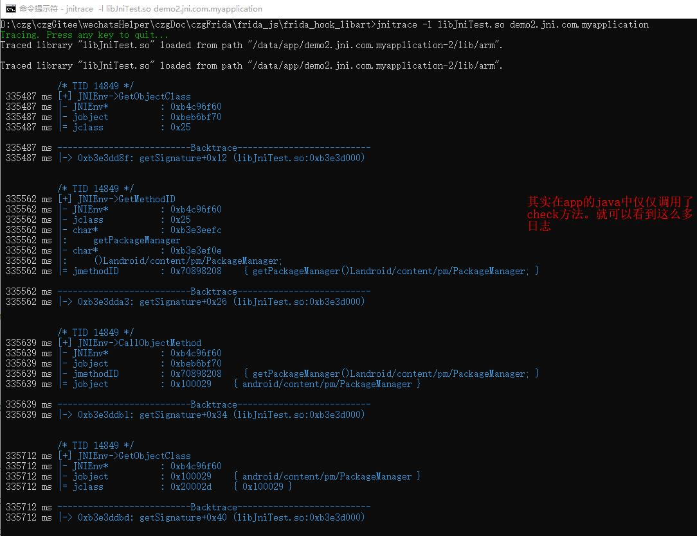
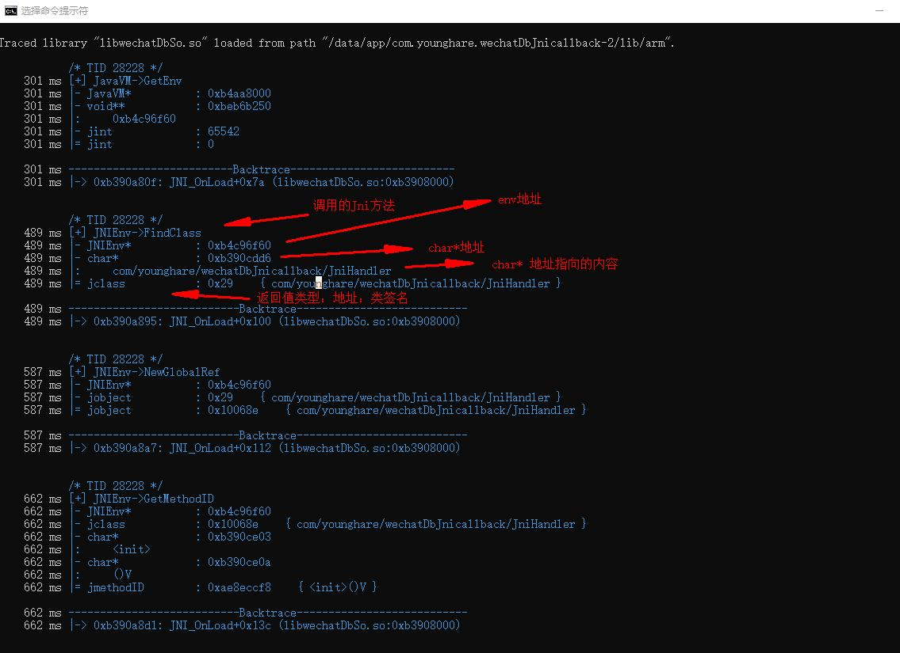

###frida开发环境搭建

1.clone 与安装

~~~
git clone https://github.com/oleavr/frida-agent-example.git
cd frida-agent-example/
npm install
~~~

2.使用vscode打开此工程，在agent文件夹下编写js，会有智能提示。
3.监控代码修改自动编译生成js文件,为了不断地重新编译变化，保持这个运行在终端
~~~
$ npm run watch
~~~
4.python脚本或者cli加载_agent.js
~~~
frida -U -f com.example.android --no-pause -l _agent.js
~~~

---

### frida安装&hook java&hook natvie
[Frida 安装和使用](https://www.jianshu.com/p/bab4f4714d98)
[frida学习笔记3 之hook so中的方法](https://www.toutiao.com/a6870403828995326472/)

###jnitrace 

###apk脱壳&协议分析
[frida安装和使用-06apk脱壳技术收集](https://www.jianshu.com/writer#/notebooks/16764822/notes/78711805)

[记一次frida实战——对某视频APP的脱壳、hook破解、模拟抓包、协议分析一条龙服务-0x指纹大佬](https://bbs.pediy.com/thread-258776.htm)
[对抗一款 App 的 token 验证-0x指纹大佬 ](https://bbs.pediy.com/thread-259455.htm)
[菜鸟学8.1版本dex加载流程笔记--第二篇:DexFile::Open流程与简单脱壳原理-挤蹭菌衣大佬](https://bbs.pediy.com/thread-257917.htm)

一个基于Frida的工具，用于跟踪JNI API在Android应用程序中的使用情况。
[jnitrace github官方](https://github.com/chame1eon/jnitrace)
[jnitrace的Python项目详细描述](https://www.cnpython.com/pypi/jnitrace)
[Frida 安装和使用-03工具使用及jnitrace及hook so中的方法](https://eternalsakura13.com/2020/07/04/frida/)

### frida 大神文章
 
[frida android hook ---r0ysue](https://eternalsakura13.com/2020/07/04/frida/)

[FRIDA脚本系列（二）成长篇：动静态结合逆向WhatsApp--r0ysue]( https://github.com/r0ysue/AndroidSecurityStudy/tree/master/FRIDA/B02)
[frida集群搭建，超详细-简单人生](https://bbs.pediy.com/thread-262232.htm)

###frida官方链接

[frida 官方js api](https://frida.re/docs/javascript-api/)
[frida官方教程](https://frida.re/docs/functions/)